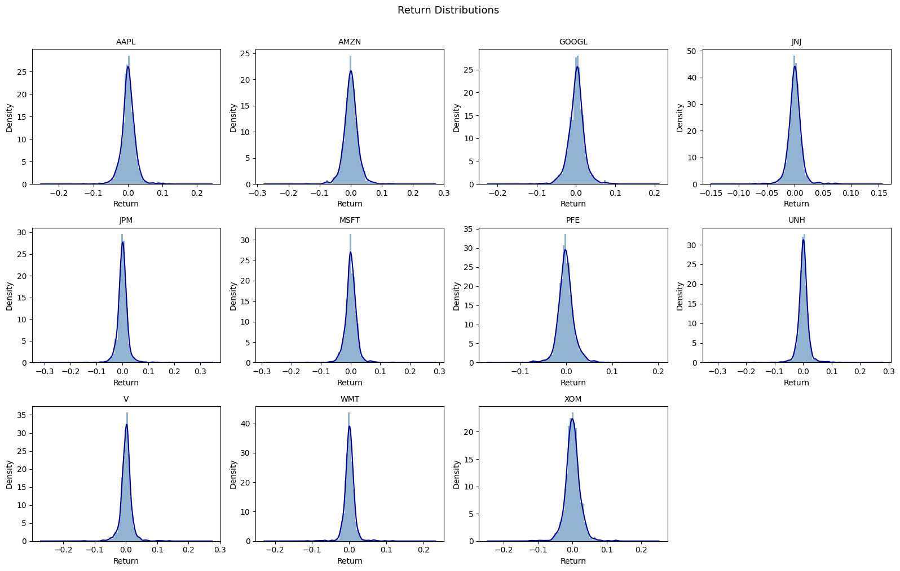
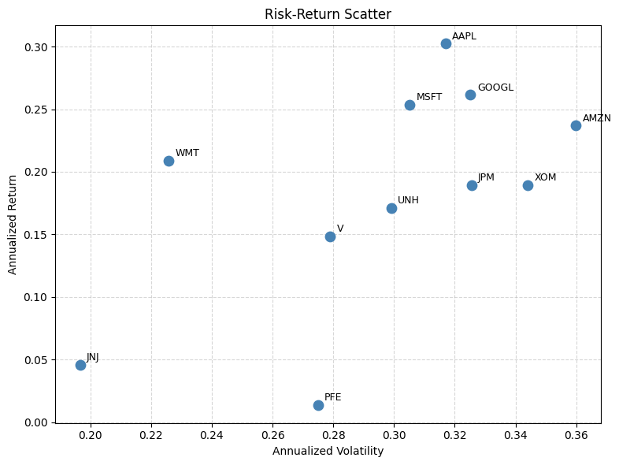
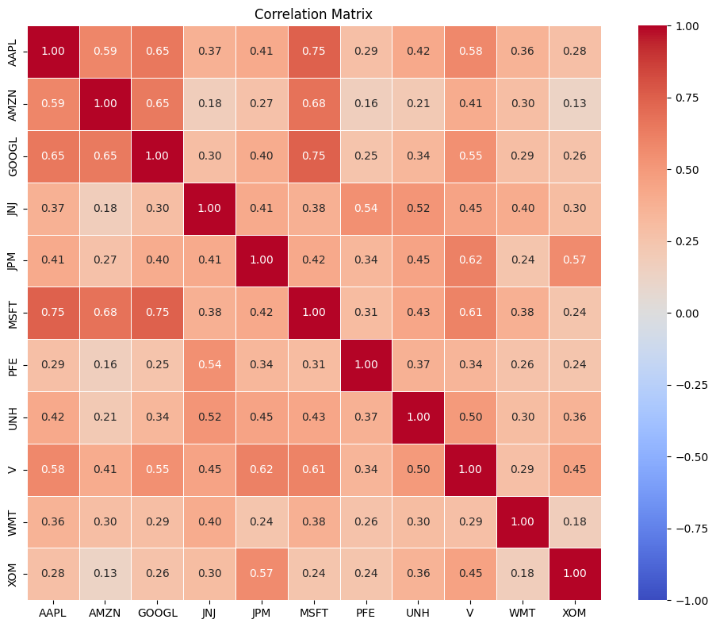
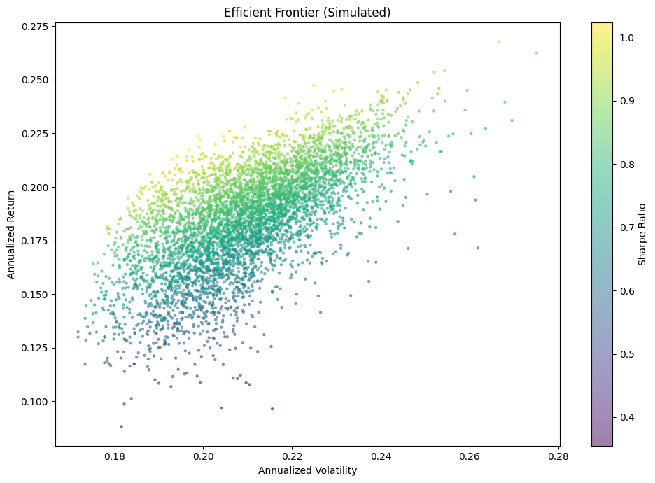
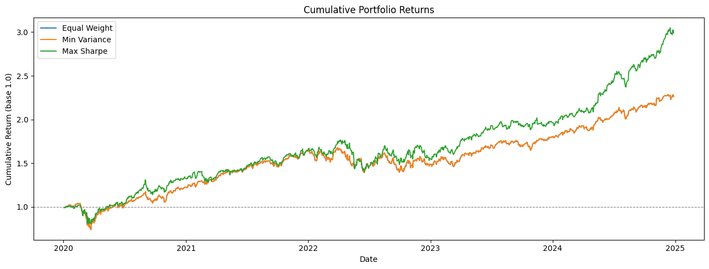
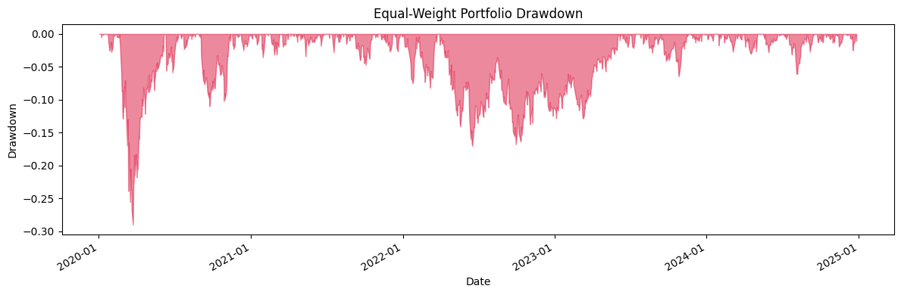
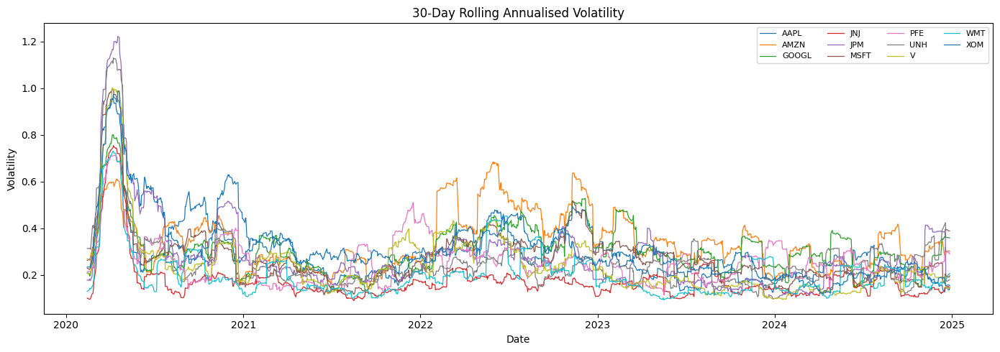

# Portfolio Risk Analyzer

> An institutional-grade, end-to-end quantitative finance pipeline that combines classical portfolio theory, machine learning forecasting, and Bayesian inference to deliver actionable risk insights across an 11-stock universe.

---

## Why This Project Matters

Most retail finance tools stop at price charts. This system goes further — it simulates the kind of pipeline used by quantitative analysts and risk desks at hedge funds and asset managers:

- **Classical finance**: VaR, CVaR, Sharpe, Sortino, Calmar, drawdown, efficient frontier
- **Portfolio optimisation**: SLSQP-based minimum variance and maximum Sharpe weight allocation
- **Machine learning**: Random Forest and XGBoost for direction classification and return regression
- **Time series**: ARIMA baseline and sliding-window Ridge regression for price forecasting
- **Bayesian inference**: Normal-Inverse-Gamma conjugate posteriors with James-Stein shrinkage

This is not a tutorial project. Every module is production-structured, tested, and backed by real market data.

---

## System Architecture

```
┌─────────────────────────────────────────────────────────────────────┐
│                        config.yaml                                  │
│           (tickers, weights, dates, confidence levels)              │
└──────────────────────────┬──────────────────────────────────────────┘
                           │
                           ▼
┌─────────────────────────────────────────────────────────────────────┐
│  01  DATA COLLECTION                                                │
│      yfinance → 11 stocks × 1,255 days → OHLCV CSVs               │
└──────────────────────────┬──────────────────────────────────────────┘
                           │
                           ▼
┌─────────────────────────────────────────────────────────────────────┐
│  02  PREPROCESSING & EDA                                            │
│      Simple returns · Log returns · Technical features             │
│      Distributions · Correlation matrix · Rolling volatility       │
└──────────┬────────────────────────────────────────┬────────────────┘
           │                                        │
           ▼                                        ▼
┌─────────────────────────┐            ┌────────────────────────────┐
│  03  PORTFOLIO ANALYSIS │            │  04  ML FORECASTING        │
│                         │            │                            │
│  · Min Variance weights │            │  · Random Forest (52.4%)   │
│  · Max Sharpe weights   │            │  · XGBoost (53.2%)         │
│  · Efficient Frontier   │            │  · ARIMA(1,0,1) baseline   │
│  · VaR / CVaR / Sharpe  │            │  · Ridge sequence model    │
│  · Sortino / Calmar     │            │    (MAE = 3.62)            │
│  · Drawdown analysis    │            │                            │
└─────────────────────────┘            └────────────────────────────┘
                           │
                           ▼
┌─────────────────────────────────────────────────────────────────────┐
│  05  BAYESIAN MODELING                                              │
│      Normal-Inverse-Gamma posteriors · James-Stein shrinkage       │
│      Posterior predictive distributions · Credible intervals       │
└─────────────────────────────────────────────────────────────────────┘
```

---

## Portfolio Universe

11 large-cap US equities across 6 GICS sectors — 2020-01-03 to 2024-12-27

| Ticker | Company | Sector | Ann. Return | Sharpe |
|---|---|---|---|---|
| AAPL | Apple | Technology | 30.2% | 0.89 |
| MSFT | Microsoft | Technology | 25.4% | 0.77 |
| GOOGL | Alphabet | Communication | 26.2% | 0.74 |
| AMZN | Amazon | Consumer Disc. | 23.7% | 0.60 |
| WMT | Walmart | Consumer Staples | 20.9% | 0.84 |
| JPM | JPMorgan | Financials | 18.9% | 0.52 |
| XOM | Exxon Mobil | Energy | 19.0% | 0.49 |
| UNH | UnitedHealth | Health Care | 17.1% | 0.51 |
| V | Visa | Financials | 14.9% | 0.46 |
| JNJ | J&J | Health Care | 4.6% | 0.13 |
| PFE | Pfizer | Health Care | 1.4% | −0.02 |

---

## Key Results

### Portfolio Optimisation

| Portfolio | Ann. Return | Sharpe | Max Drawdown | 5yr Cumulative |
|---|---|---|---|---|
| Equal Weight | 18.4% | 0.82 | −29.0% | +126.1% |
| Minimum Variance | 18.4% | 0.82 | −29.0% | +126.1% |
| **Maximum Sharpe** | **24.1%** | **1.08** | **−20.9%** | **+199.0%** |

### Risk Metrics (Equal-Weight Portfolio)

| Metric | Value | What it means |
|---|---|---|
| VaR (95%) | 1.65% daily | On 95% of days, loss will not exceed 1.65% |
| CVaR (95%) | 3.00% daily | Average loss on the worst 5% of days |
| Sharpe Ratio | 0.82 | 0.82 units of return per unit of risk |
| Sortino Ratio | 0.78 | Penalises only downside volatility |
| Calmar Ratio | 0.63 | Annual return relative to worst drawdown |
| Max Drawdown | −29.0% | Worst peak-to-trough decline (COVID crash) |

### ML Forecasting (AAPL)

| Model | Task | Result |
|---|---|---|
| Random Forest | Direction classification | 52.4% accuracy |
| XGBoost | Direction classification | 53.2% accuracy |
| Random Forest | Return regression | MAE 0.0105 |
| XGBoost | Return regression | MAE 0.0108 |
| Ridge Sequence | Price forecasting | MAE 3.62 |
| ARIMA(1,0,1) | Returns baseline | ADF p < 0.0001 |

---

## Visual Insights

### Return Distributions — Understanding tail risk


---

### Risk–Return Tradeoff — Which stocks are efficient?


---

### Correlation Structure — Diversification check


---

### Efficient Frontier — Portfolio optimization landscape


---

### Portfolio Performance — Does optimization work?


---

### Risk Control — Drawdown analysis


---

### Market Stress — Rolling volatility



## Project Structure

```
Stockmarket/
├── config.yaml                        ← Tickers, weights, risk parameters
├── requirements.txt
├── conftest.py
├── data/
│   └── raw/
│       ├── stock_data.csv             ← OHLCV — 11 stocks × 1,256 rows
│       ├── stock_returns.csv          ← Daily simple returns
│       └── stock_log_returns.csv      ← Daily log returns
├── notebooks/
│   ├── 01_data_collection.ipynb
│   ├── 02_eda.ipynb
│   ├── 03_portfolio_analysis.ipynb
│   ├── 04_ml_forecasting.ipynb
│   └── 05_bayesian_modeling.ipynb
├── src/
│   ├── utils/        config.py · helpers.py
│   ├── data/         fetch_data.py · preprocess.py
│   ├── analysis/     risk_metrics.py · portfolio.py
│   ├── models/       supervised_ml.py · time_series.py
│   └── visualization/plots.py
├── tests/
│   ├── test_data.py
│   ├── test_risk_metrics.py
│   └── test_models.py
├── reports/figures/                   ← All 17 exported charts
└── docs/
    ├── METHODOLOGY.md
    └── PORTFOLIO_SELECTION.md
```

---

## How to Run

```bash
# Install dependencies
pip install -r requirements.txt

# Run notebooks in order (01 → 05)
jupyter notebook

# Run tests
python -m pytest tests/ -v
```

> All notebooks use the `stock` kernel (Python 3.10). After running notebook 01 once, notebooks 02–05 can be run independently.

---

## Tech Stack

| Layer | Libraries |
|---|---|
| Data | pandas, numpy, yfinance |
| Visualisation | matplotlib, seaborn |
| Optimisation | scipy (SLSQP) |
| Statistics | scipy.stats, statsmodels (ARIMA, ADF) |
| Machine Learning | scikit-learn (Random Forest, Ridge, StandardScaler) |
| Boosting | xgboost |
| Config | pyyaml |
| Testing | pytest (39 tests) |

---


